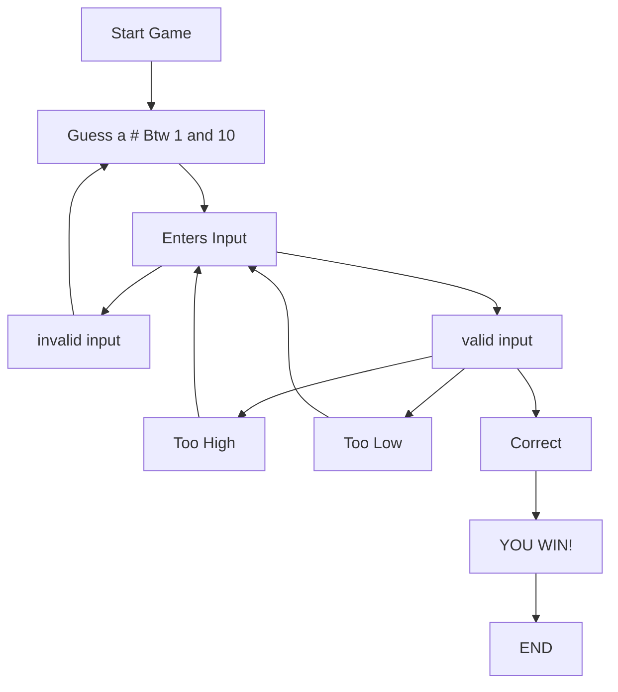

```mermaid
flowchart TD
    A[Start Game] --> B[Guess a # Btw 1 and 10]
    B --> C[Enters Input]
    C --> D[invalid input]
    C --> E[valid input]
    D --> B
    E --> F[Too High]
    E --> G[Too Low]
    F --> C
    G --> C
    E -->  H[Correct]
    H--> I[YOU WIN!]
    I --> J[END]
    %%step 1: user enters input
    %%step 2: user enter invalid input
    %%step 3 User reenters input
    %%step 4 user enters vaild input
    %%step 5: User input is too high
    %%step 6: User renters input
    %%step 7: User input is too low
    %%step 8: User reenters input
    %%step 9: User enters correct guess
    %%step 10: YOU WIN, end game
```
